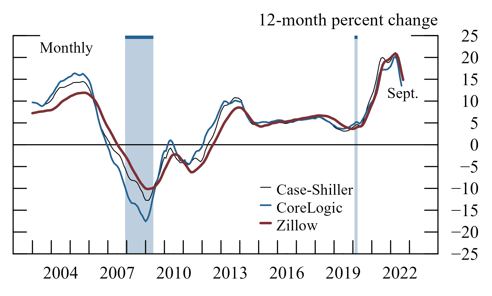

# `fedplot`: R package to create Fed-style ggplot2 charts



## Installation

To install or update `fedplot`, run:

```
## Install current version from GitHub
devtools::install_github("fedplot/fedplot", build_vignettes=FALSE)

## Then load the package as you would any other
library(fedplot)
```

## TO-DO

1. Add documentation and pkgdown website
2. Convert `line.R` into a vignette.
3. Add examples for bar charts
4. Add wrappers to the geom_hline (maybe set as an option to `theme_fed`), to the scale_* functions, and to geom_line (so it uses the group aes into its color and linewidth aes, plus the other options).

