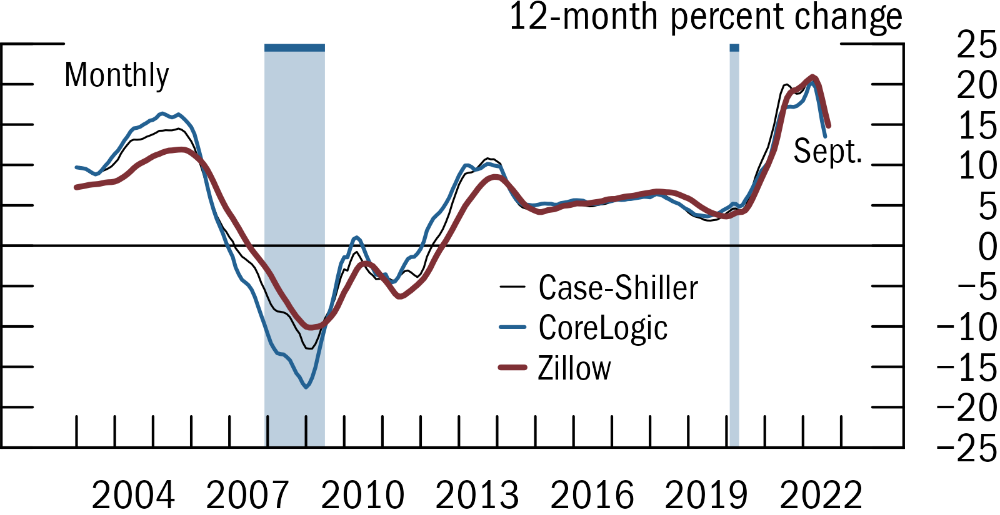

# `fedplot`: Fed-style ggplot2 charts 

This is an R package containing ggplot2 themes and extensions that replicate the Fed-style plots (as in the [FSR](https://www.federalreserve.gov/publications/financial-stability-report.htm)) within ggplot.

It's currently a work-in-progress (version 0.2), with planned improvements including:

1. Wrappers around options, so they are less verbose (e.g. `scale_*` below).
2. Documentation and website.
3. Better automated placement of legend and text labels.
4. Better testing of different OSes and chart types.


## Quick example

(Also see [here](/demo/lines.R) for a self-contained script)

```R
library(fedplot)

ggplot(plotdata, aes(x = Date, y = value, group=source)) +
  geom_recessions(draw_top_bar=T)
  geom_hline(yintercept = 0, linewidth = fedplot_constants$linewidth, linejoin = "mitre", lineend = "round") +
  geom_line(aes(color=source, linewidth=source), na.rm = T, linejoin = "mitre", lineend = "round") +
  labs(y = "12-month percent change") +
  scale_x_date(minor_breaks=seq(from=as.Date("2003-01-01"), to=as.Date("2023-01-01"), by="1 years"),
               breaks=seq(from=as.Date("2004-06-30"), to=as.Date("2023-06-30"), by="3 years"),
               date_labels="%Y",
               expand=expansion(mult=.05)) +
  scale_y_continuous(sec.axis = dup_axis(),
                     breaks = seq(-25, 25, by=5),
                     limits = c(-25, 25),
                     expand = expansion(mult=0),
                     labels = scales::label_number(style_negative = "minus")) +
  annotate_last_date(nudge_y = -3, nudge_x = 300)
  theme_fed(legend_position = c(.8, .1))

save_plot('image3', size='n', extension='all')
```

<p align="center">
  
</p>

## Installation

To install or update `fedplot`, run:

```
## Install current version from GitHub
devtools::install_github("fedplot/fedplot", build_vignettes=FALSE)

## Then load the package as you would any other
library(fedplot)
```

## TO-DO

1. Add documentation and pkgdown website
2. Convert `line.R` into a vignette.
3. Add examples for bar charts
4. Add wrappers to the geom_hline (maybe set as an option to `theme_fed`), to the scale_* functions, and to geom_line (so it uses the group aes into its color and linewidth aes, plus the other options).

