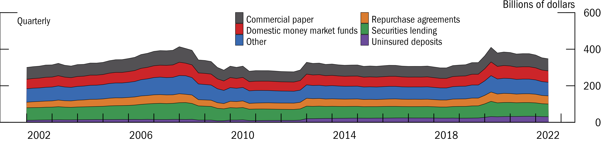

This section will demo how to create a stacked area plot in _fedplot style_, using Figure 4.1 of the [November 2022 FSR](https://www.federalreserve.gov/publications/files/financial-stability-report-20221104.pdf) as a reference.

```{r, include = FALSE}
knitr::opts_chunk$set(
  collapse = TRUE,
  comment = "#>"
)
```


## Example area plot


First, we load `ggplot2`, `fedplot` (which contains the sample dataset `FSR_4_1`), and `scales`.

```{r setup, include = FALSE}
knitr::opts_chunk$set(echo = FALSE)
```

```{r, include= TRUE, echo = TRUE}
library(ggplot2)
library(fedplot)
library(scales)

packageVersion("fedplot")
head(FSR_4_1)
```

We can construct the area plot using standard `ggplot2` functions:

```{r, include = TRUE, echo = TRUE}
FSR_4_1 |>
  ggplot(aes(x = date, y = value, fill=type)) +
  geom_area() +
  labs(y="Percent of GDP")
```

Now we customize it:


```{r, include = TRUE, echo = TRUE}
linewidth <- getOption("fedplot.linewidth_adj") * 0.25

FSR_4_1 |>
  ggplot(aes(x = date, y = value, fill=type)) +
  geom_area(color="black", linewidth=linewidth, key_glyph=draw_key_square) +
  labs(y="Billions of dollars") +
  geom_hline_zero() +
  scale_x_date(minor_breaks=seq(from=as.Date("2002-01-01"), to=as.Date("2023-01-01"), by="1 years"),
               breaks=seq(from=as.Date("2002-06-30"), to=as.Date("2022-06-30"), by="4 years"),
               date_labels="%Y",
               expand=expansion(mult=.05)) +
  scale_y_continuous(sec.axis = dup_axis(),
                   breaks = seq(0, 600, by=200),
                   limits = c(0, 600),
                   expand = expansion(mult=0),
                   labels = scales::label_number(style_negative = "minus")) +
  #annotate_last_date() + # nudge_y = -3, nudge_x = 300) +
  theme_fed(legend_position = c(.8, .7),
            fill_palette=fedplot::bsvr_colors) + guides(fill=guide_legend(ncol=2))
```

Lastly, we want to export the chart so it matches the required dimensions and other image characteristics:

```{r, include = TRUE, echo = TRUE}
save_plot('areaplot', size='wide', extension='all')
```

After exporting through `save_plot`, the chart looks like this:





## Pending tasks:

1. Get data in percent of GDP instead of USD.
1. Get correct colors
1. Add numbers to legends and annotations
1. Add black stripped area for the period from 2008:Q4 to 2012:Q4

