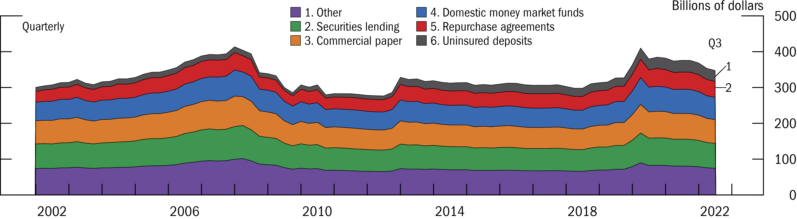

This section will demo how to create a stacked area plot in _fedplot style_, using Figure 4.1 of the [November 2022 FSR](https://www.federalreserve.gov/publications/files/financial-stability-report-20221104.pdf) as a reference.

```{r, include = FALSE}
knitr::opts_chunk$set(
  collapse = TRUE,
  comment = "#>"
)
```


## Example area plot


First, we load `ggplot2`, `fedplot` (which contains the sample dataset `FSR_4_1`), and `scales`.

```{r setup, include = FALSE}
knitr::opts_chunk$set(echo = FALSE)
```

```{r, include= TRUE, echo = TRUE}
#devtools::load_all()
library(ggplot2)
library(fedplot)
library(scales)
library(forcats)

packageVersion("fedplot")
head(FSR_4_1)
```

We can construct the area plot using standard `ggplot2` functions:

```{r, include = TRUE, echo = TRUE}
FSR_4_1 |>
  ggplot(aes(x = date, y = value, fill=type)) +
  geom_area() +
  labs(y="Percent of GDP")
```

Now we customize it:


```{r, include = TRUE, echo = TRUE}
linewidth <- getOption("fedplot.linewidth_adj") * 0.25
font_size <- unit(getOption("fedplot.font_size") * 7L / 8L / ggplot2::.pt, "bigpts")
font_family <- getOption("fedplot.font_family")
maxdate <- max(FSR_4_1$date)

FSR_4_1 |>
  dplyr::mutate(
    type = dplyr::case_when(
  	  type == "Other" ~ "1. Other",
  	  type == "Securities lending" ~ "2. Securities lending",
  	  type == "Commercial paper" ~ "3. Commercial paper",
  	  type == "Domestic money market funds" ~ "4. Domestic money market funds",
  	  type == "Repurchase agreements" ~ "5. Repurchase agreements",
  	  type == "Uninsured deposits" ~ "6. Uninsured deposits",
  	  .default = "N/A")) |>
  dplyr::mutate(type=forcats::fct_rev(factor(type))) |> 
  #dplyr::mutate(type=factor(type)) |> 
  ggplot(aes(x = date, y = value, fill=type)) +
  geom_area(color="black", linewidth=linewidth, key_glyph=draw_key_square, outline.type="full") + # TBH looks better with color="white"...
  labs(y="Billions of dollars") +
  geom_hline_zero() +
  scale_x_date(minor_breaks=seq(from=as.Date("2002-01-01"), to=as.Date("2023-01-01"), by="1 years"),
               breaks=seq(from=as.Date("2002-06-30"), to=as.Date("2022-06-30"), by="4 years"),
               date_labels="%Y",
               expand=expansion(mult=.05)) +
  scale_y_continuous(sec.axis = dup_axis(),
                   breaks = seq(0, 500, by=100),
                   limits = c(0, 500),
                   expand = expansion(mult=0),
                   labels = scales::label_number(style_negative = "minus")) +
  annotate_last_date(nudge_y = 350) +
  
  # Demo of how we could start implementing the number annotations...
  # See also: https://stackoverflow.com/questions/10393956/add-direct-labels-to-ggplot2-geom-area-chart
  geom_segment(aes(x=maxdate, y=330, xend=maxdate+120, yend=360), linewidth=linewidth, lineend="round") +
  annotate("text", x=maxdate+150, y=360, label="1", size=font_size, family=font_family) +
  geom_segment(aes(x=maxdate, y=300, xend=maxdate+120, yend=300), linewidth=linewidth, lineend="round") +
  annotate("text", x=maxdate+150, y=300, label="2", size=font_size, family=font_family) +
  
  # Hack to add an outline around the stacked area geom
  #geom_line(aes(ymax=value), position="stack", linewidth=linewidth) +
  
  guides(fill=guide_legend(ncol=2, reverse=TRUE)) +
  theme_fed(legend_position = c(.38, 1.1),
            fill_palette=fedplot::bsvr_colors,
            size='wide')
```

Note that to achieve the exact ordering used in the FSR (where the stacked areas have a reverse order but the legend has an alphabetical order) we can use several two tricks:

1. Use `forcats::fct_rev` to reverse the order of the `type` variable (see also [this link](https://wilkelab.org/SDS375/slides/getting-things-in-order.htm)).
2. Call `guide_legend()` with the `reverse=TRUE` option.

Lastly, we want to export the chart so it matches the required image characteristics:

```{r, include = TRUE, echo = TRUE}
save_plot('areaplot', extension='all')
```

After exporting through `save_plot`, the chart looks like this:





## Pending tasks:

1. Add the pattern area, using [ggpattern](https://coolbutuseless.github.io/package/ggpattern/).
1. Get data in percent of GDP instead of USD. Also check the actual values for the OTHER category.
1. Get correct colors
1. Add numbers to legends and annotations
1. Add black stripped area for the period from 2008:Q4 to 2012:Q4
