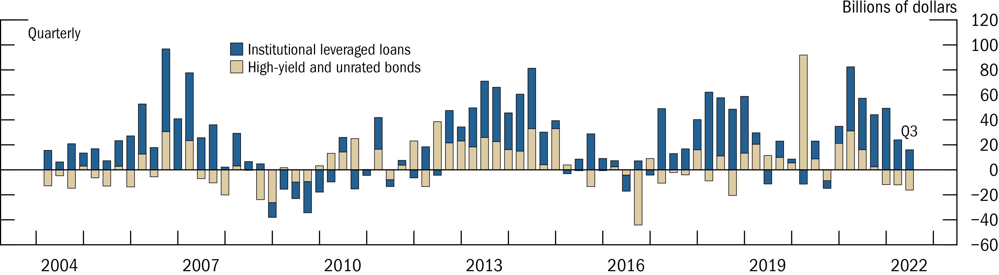

This section will demo how to create a barplot in _fedplot style_, using Figure 2.4 of the [November 2022 FSR](https://www.federalreserve.gov/publications/files/financial-stability-report-20221104.pdf) as a reference.

```{r, include = FALSE}
knitr::opts_chunk$set(
  collapse = TRUE,
  comment = "#>"
)
```


## Example barplot


First, we load the required packages(`ggplot2` and `fedplot`, plus `dplyr` and `scales`). Note that the sample dataset `FSR_2_4` ), and `scales`.

```{r setup, include = FALSE}
knitr::opts_chunk$set(echo = FALSE)
```

```{r, include= TRUE, echo = TRUE}
library(ggplot2)
library(dplyr, warn.conflict=FALSE)
library(fedplot)
library(scales)

packageVersion("fedplot")
head(FSR_2_4)
```

We can construct the barplot using standard `ggplot2` functions:

```{r, include = TRUE, echo = TRUE}
# Caption disabled for FSR; enabled otherwise through labs()
caption <- "Source: Mergent, Fixed Income Securities Database; PitchBook Data, Leveraged Commentary & Data."

# If we don't want the default alphabetical order, we can do use factor() and a) use relevel() afterwards or specify the levels option.
levels <- c("Institutional leveraged loans", "High-yield and unrated bonds")

FSR_2_4 |>
  dplyr::mutate(type = factor(risky_debt_type, levels=levels)) |>
  ggplot(aes(x = date, y = value, fill=type)) +
  geom_col() +
  labs(y="Billions of dollars") # , caption=caption)
```

Now we customize it:


```{r, include = TRUE, echo = TRUE}
linewidth <- getOption("fedplot.linewidth_adj") * 0.25
levels <- c("Institutional leveraged loans", "High-yield and unrated bonds")

FSR_2_4 |>
  dplyr::mutate(type = factor(risky_debt_type, levels=levels)) |>
  ggplot(aes(x = date, y = value, fill=type)) +
  geom_col(color="black", linewidth=linewidth, width=60, key_glyph=draw_key_square) + # Width is in days
  labs(y="Billions of dollars") +
  geom_hline_zero() +
  scale_x_date(minor_breaks=seq(from=as.Date("2003-01-01"), to=as.Date("2023-01-01"), by="1 years"),
               breaks=seq(from=as.Date("2004-06-30"), to=as.Date("2022-06-30"), by="3 years"),
               date_labels="%Y",
               expand=expansion(mult=.05)) +
  scale_y_continuous(sec.axis = dup_axis(),
                   breaks = seq(-60, 120, by=20),
                   limits = c(-60, 120),
                   expand = expansion(mult=0),
                   labels = scales::label_number(style_negative = "minus")) +
  annotate_last_date(nudge_y = 15) +
  theme_fed(legend_position = c(.45, .7),
            fill_palette=c("#236192", "#DDCBA4")) # + theme(legend.key.height = grid::unit(0.75, 'bigpts'))
```

Lastly, we want to export the chart so it matches the required dimensions and other image characteristics:

```{r, include = TRUE, echo = TRUE}
save_plot('barplot', size='wide', extension='all')
```

After exporting through `save_plot`, the chart looks like this:





## Pending tasks:

1. Legend symbols are not squares, but rectangles with height enlarged to span the line height. This is done [on purpose](https://github.com/tidyverse/ggplot2/issues/3669) on ggplot2 but can be [changed](https://stackoverflow.com/questions/65812949/set-standard-legend-key-size-with-long-label-names-ggplot) by custom legend functions.
1. Is there a rule for the bar width? Note that it's set in terms of _days_ and not in an absolute size.
1. Add a `geom_col_fed` function that automatically sets the required color (black) and linewidth (0.25 times adjustment).
1. Automatically use the required color fill palette (which needs to be determined).

