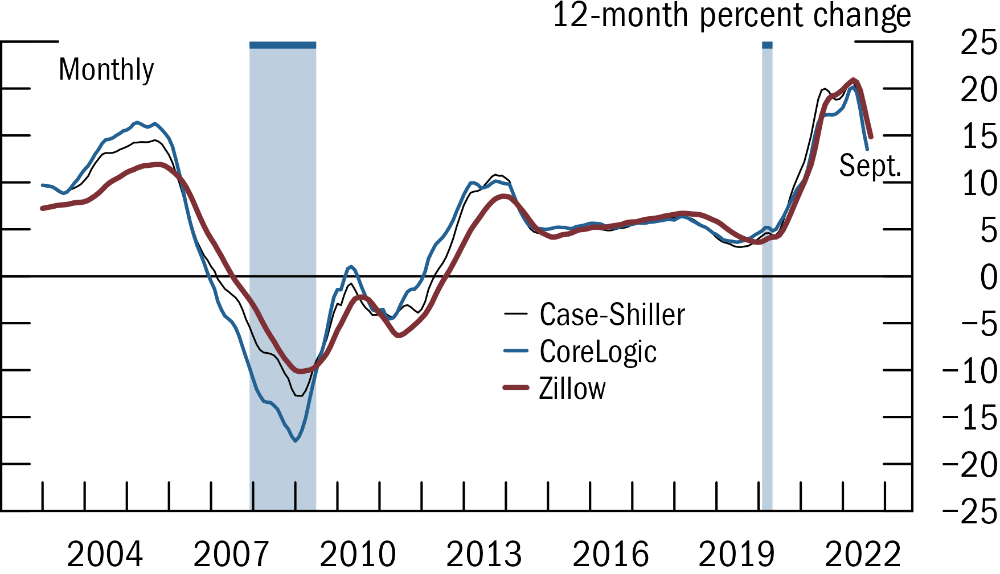

This section will demo how to create a line plot in _fedplot style_, using Figure 1.17 of the [November 2022 FSR](https://www.federalreserve.gov/publications/files/financial-stability-report-20221104.pdf) as a reference.

```{r, include = FALSE}
knitr::opts_chunk$set(
  collapse = TRUE,
  comment = "#>"
)
```


## Example line plot


First, we load the required packages(`ggplot2` and `fedplot`, plus `dplyr` and `scales`). Note that the sample dataset `FSR_1_17` is part of the `fedplot` package.

```{r setup, include = FALSE}
knitr::opts_chunk$set(echo = FALSE)
```

```{r, include= TRUE, echo = TRUE}
#devtools::load_all()
library(ggplot2)
library(dplyr, warn.conflict=FALSE)
library(fedplot)
library(scales)

packageVersion("fedplot")
head(FSR_1_17)
```

We can construct the line plot using standard `ggplot2` functions:

```{r, include = TRUE, echo = TRUE}
FSR_1_17 |>
  ggplot(aes(x = date, y = value, color=source)) +
  geom_line() +
  labs(y="12-month percent change")
```

Now we customize it:


```{r, include = TRUE, echo = TRUE}
FSR_1_17 |>
  ggplot(aes(x = date, y = value, group=source)) +
  geom_recessions() +
  geom_hline_zero() +
  geom_line_fed() +
  labs(y = "12-month percent change") +
  scale_x_date(
       minor_breaks=seq(from=as.Date("2003-01-01"), to=as.Date("2023-01-01"), by="1 years"),
       breaks=seq(from=as.Date("2004-06-30"), to=as.Date("2023-06-30"), by="3 years"),
       date_labels="%Y",
       expand=expansion(mult=.05)) +
  scale_y_continuous(
    sec.axis = dup_axis(),
    breaks = seq(-25, 25, by=5),
    limits = c(-25, 25),
    expand = expansion(mult=0),
    labels = scales::label_number(style_negative = "minus")) +
  annotate_last_date(nudge_y = -3, nudge_x = 0) +
  theme_fed(legend_position = c(.55, .5))
```

Lastly, we want to export the chart so it matches the required image characteristics:

```{r, include = TRUE, echo = TRUE}
save_plot('lineplot', extension='all')
```

After exporting through `save_plot`, the chart looks like this:


